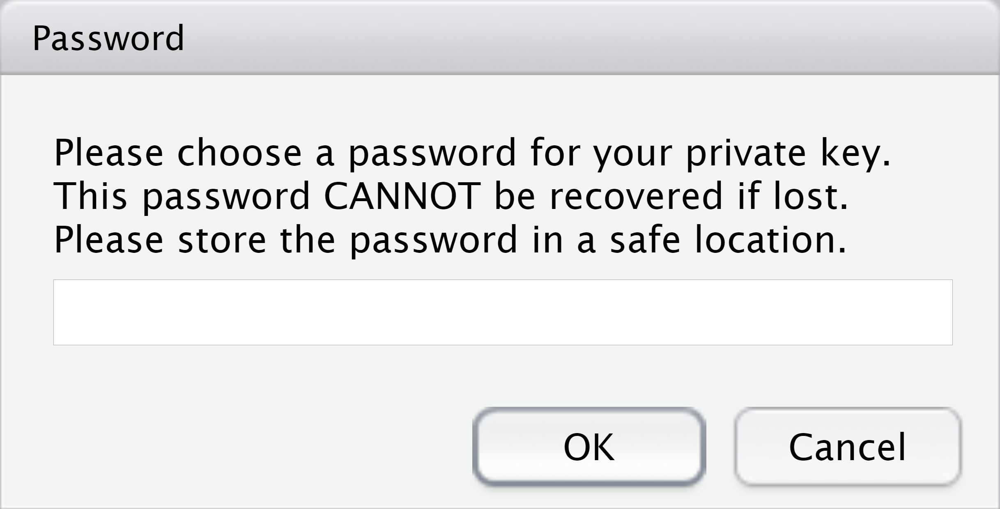

```{r setup, include=FALSE}
knitr::opts_chunk$set(echo = FALSE)
```
```{r, include = FALSE}
system(paste0("rm ", getwd(), "/id_rsa*"))
options(width=70)
options(dplyr.print_min = 6, dplyr.print_max = 6)
```


## Why we are waking up to the value of our own data {#waking-up-to-data}
```{r  out.width = "60%", fig.align='center'}
 
```

Scotsman, Aug-30, 2019

## Data Governance {.fourlinestext}

- Data is precious and sensitive

- Confidential data (when possible) should be anonymised or pseudonomysed

- Patients expect us to safeguard their data

- Data can be minimised, deleted or encrypted


## Research and Data {.fourlinestext}

- Data governance approvals are key components of research approvals

- GDPR (Europe) and HIPAA etc. (USA)

- Data breaches are financially and reputationally costly

- Not all data can be removed from records


## Encryptr {.fourlinestext}

- Easy pseudonymisation by encryption

- RSA encryption with private / public key pair (asymmetric)

- Encryption of vectors, variables and files

- Secure storage of confidential data (and allocation concealment / blinding)


## Encryptr on CRAN / Github
<b>
```{r installation, eval=FALSE, echo=TRUE}
install.packages("encryptr") # CRAN
remotes::install_github("SurgicalInformatics/encryptr")
```

https://github.com/surgicalinformatics
</b>

----

```{r encryptr-data, echo = TRUE, message=FALSE}

library(encryptr)

library(dplyr) # Used in presentation examples

# Encryptr comes with an example data set of GPs (Family Physicians)

gp

```

## Public and Private Keys {.basictext}
```{r genkeys, echo = TRUE, message = FALSE, warning=FALSE}

genkeys()

```
Default values are <span style="color:green">"id_rsa"</span> and <span style="color:green">"id_rsa.pub"</span>


## No Raw Text Password {data-background=#E1D9D7}
```{r  out.width = "60%", fig.align='center'}
 
```


----
```{r encrypt_var, echo = TRUE}

gp_encrypt = gp %>% 
  encrypt(name)

gp_encrypt %>% 
  select(organisation_code, name, address1)
```


----
```{r decrypt_var, echo=TRUE}

gp_encrypt %>%
  slice(1:2) %>%
  decrypt(name) %>% 
  
  select(organisation_code, name, address1)
```

## Encryptr Customisation {.fourlinestext}

- Use look-up table - create object with encrypted output and ID variable on which to match

- Write a look-up file

- Customise file names, key names, encrypt several variables

- Use a publicly-available public key

## Encryptr Customisation Examples
```{r encryptr-customisation, eval=FALSE, echo=TRUE}
# Creating a lookup table with specified name and filename

gp %>% 
  encrypt(name, postcode, 
          lookup = TRUE, write_lookup = TRUE, 
          lookup_name = "new_lookup_name")


# Using a public key hosted at URL
gp %>% 
  encrypt(name, public_key_path = "https://<some_url>/id_rsa.pub")

```

## Encryptr File Encryption
```{r file-encryption, eval=FALSE, echo=TRUE}
gp_encrypt %>% write_csv("gp_enc.csv")


encrypt_file("gp.csv")


# Encrypted file will have suffix: `.encryptr.bin`
decrypt_file("gp.csv.encryptr.bin", file_name = "gp2.csv")

```

## Encryptr Ciphertexts Not Matchable {.fourlinestext}
- Each repeat of encryption generates a unique number

- Prevents malicious, opportunistic use of public key

- Alternative symmetric encryption outputs can be matched (and not always reversed)

- Alternative methods need a "salt"

----
```{r encryptr-rep, echo=TRUE}

encrypt_vec(c("a name", "a name", "a name"))

```

## Technical Aspects of Encryptr {.fourlinestext}
- Wrapper around OpenSSL (and purrr)

- RSA asymmetric encryption for vectors (each component in vector < 256 bytes)

- File encryption uses AES technique with symmetric session key which is in turn encrypted by RSA public key


## What Encryptr Is Useful For {.fourlinestext}

- Storing confidential data in trials, cohorts, service evaluation, etc.

- Retrieving individual data if needed

- Blinding in RCTs

- Data governance considerations

## Questions
